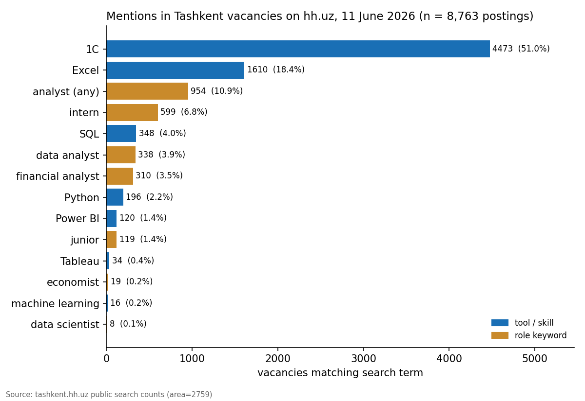

# Tashkent Job Market Scan

What do analytical employers in Tashkent actually ask for? A count of skill and role keywords across all vacancies on hh.uz, Uzbekistan's largest job board.



## Question

Career advice for economics students usually names Python, SQL, and machine learning. Does demand in Tashkent match that advice? This project counts how many of the ~8,800 live Tashkent vacancies mention each skill or role keyword.

## Data

Result counts from public search pages on [tashkent.hh.uz](https://tashkent.hh.uz) (hh.ru area 2759), collected 11 June 2026. One snapshot, saved in `data/skill_demand.csv`. The official hh API now requires authorization for vacancy search, so `src/01_collect.py` reads the counter shown on the public search page — one request per keyword, a second apart.

Russian search terms, since most Tashkent postings are written in Russian.

## Method

Plain counting with pandas, plotted with matplotlib. Run order: `src/01_collect.py` (refresh, optional) → `src/02_analyze.py`.

```
pip install requests pandas matplotlib
```

## Findings

**Excel beats Python eight to one.** Excel appears in ~18% of all Tashkent vacancies (1,610), Python in ~2% (196). The 1С accounting platform dwarfs both (4,473 — half of all postings mention it), a reminder that the local market still runs on accounting and operations roles.

**Analyst demand is real but mostly financial.** "Аналитик" matches ~950 postings; the largest named sub-group is financial analyst (310), then data analyst (338). Pure data-science roles barely exist: 8 postings for "data scientist", 16 for "machine learning".

**For a student, the practical reading:** strong Excel plus SQL (348 postings) covers far more of the Tashkent market than machine learning does, and Python's value here is as a complement, not the headline skill.

## Caveats

These are keyword matches, not job descriptions read by a human: "Excel" in a posting may mean daily modelling or a formality in the requirements list. Counts overlap (one vacancy can match several terms). hh.uz under-represents government bodies and international organizations, which hire through their own channels — exactly the employers most relevant for economic-policy work. One snapshot, one city, no time series; rerun `01_collect.py` to track changes.

## Structure

```
├── data/      # skill_demand.csv (snapshot, 2026-06-11)
├── src/       # 01_collect.py, 02_analyze.py
└── output/    # figure
```
